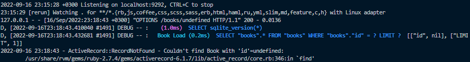

# Phase III Project: Fantasy Novel App

    Author: Wycliffe Ndiba

## Overview

This project is a web application that allows users to browse fantasy novels and sort them how they want. The user can also add novels to their cart and checkout.
The application is built using the sinatra framework and uses a rakefile to manage the database.

> Note:
> At the time of submission the project is not yet done but I am constantly working on it (the fundamentals are done, it just needs to work well).
> Comments from the TM are welcome.

## Technologies Used

### Backend

    Ruby
    Sinatra
    Active Record

### Frontend

    React
    Javascript
    CSS

## Live Link

### Frontend

[Book Review App](https://fantasy-book-store-frontend.vercel.app/)

### Backend

[Ruby (Heroku) API](https://book-review-app-espersonnel.herokuapp.com/)

## Installation

To install this application, clone the backend and frontend repositories.

### Backend

1. Clone the backend repository from [here](https://github.com/ESPersonnel/Fantasy-Book-Store-Backend)

2. Run `bundle install` to install the required gems.

3. Run `bundle exec rake db:migrate` to create the database.

4. Run `bundle exec rake db:seed` to seed the database.

5. Finally run `bundle exec rake server` to run the backend.

### Frontend

1. Clone the frontend repository from [here](https://github.com/ESPersonnel/Fantasy-Book-Store-Frontend)

2. Run `npm install` to install the required packages.

3. Run `npm start`.

## ERD Relationship Diagram

    Key:
    One to Many  1 ----< ∞
    Many to Many ∞ ----< ∞

    Readers --------------< Reviews >----------- Books >-------------- Author
    :reader_name           :reader_id           :author_id            :series_title
    :email                 :book_id             :title                :author_name
    :birthday              :title               :genre                :series
    :phone_no              :content             :publication_date
 

## Relationships
### Readers
    has_many :reviews
    has_many :books, through: :reviews

### Reviews
    belongs_to :reader
    belongs_to :book

### Books
    has_many :reviews
    has_many :readers, through: :reviews
    belongs_to :author

### Authors
    has_many :books

## Current Progress

### Backend

The backend is currently complete. It has all the required routes and controllers. The database is seeded with data.

Any other informational data will be added to this section as the project progresses.

### Frontend

The frontend is coming along but is not complete. The application can currently do the following:

- Displays all the book details from the Backend database.
- Displays all the author details from the Backend database.
- Displays all the review details from the Backend database.

Functionality to be added:

- Functionality to add, edit and delete books, authors and reviews.
- Styling to make the application look better.

## Features added and rolled back

### Frontend

- Added Firebase authentication but rolled it back because it was not working properly and wasted my time.
- Added a search bar but it broke my application so I rolled it back.

> Note: These features will be added back in the future. This might be a good project to present as a portfolio piece so I want to make it look good.

## Known Bugs

Bug 1

    The application cannot delete files from the backend. The React code has access to the backend and Ruby recognizes it but something is stopping the full transactions.

## Licence

The MIT Licence (MIT)

- [Licence](./LICENCE)